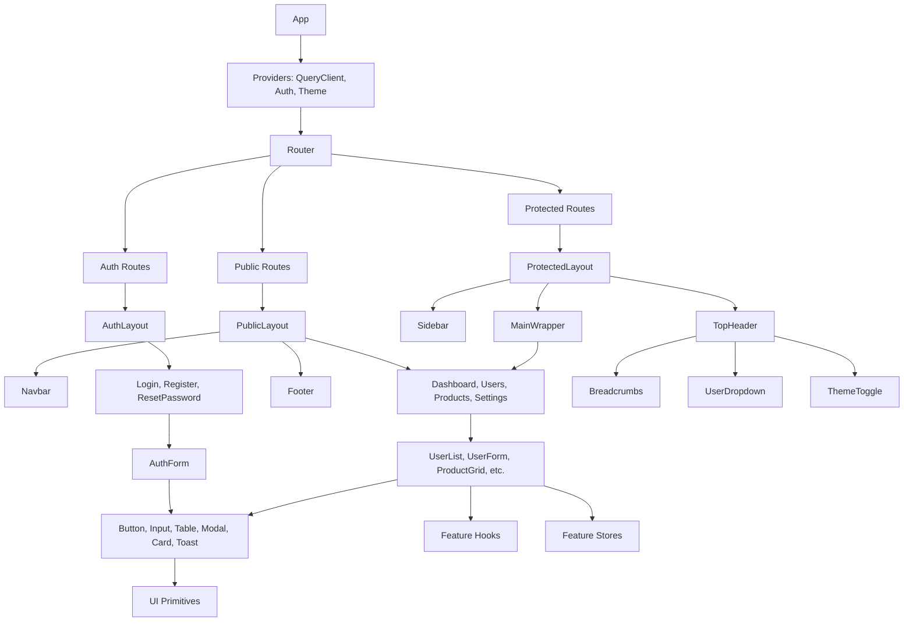

# Component Architecture

## Overview

The application uses a **layout-driven component architecture** with three primary layout shells (Public, Auth, Protected) and a shared component library. Components are organized by reusability scope: global primitives, layout shells, and feature-specific compositions.

> **Source:** component-architecture.md § Architecture Overview

---

## 1. Layout Components

### PublicLayout
**File:** `components/layout/PublicLayout/PublicLayout.tsx`
**Purpose:** Wrapper for public-facing pages (landing, about, pricing). Includes Navbar and Footer but no sidebar.

```tsx
// Source: source-004.md § components/layout/PublicLayout.tsx
interface PublicLayoutProps {
  children: React.ReactNode;
  className?: string;
}

export function PublicLayout({ children, className }: PublicLayoutProps) {
  return (
    <div className={cn('min-h-screen flex flex-col', className)}>
      <Navbar />
      <main className="flex-1">{children}</main>
      <Footer />
    </div>
  );
}
```

### AuthLayout
**File:** `components/layout/AuthLayout/AuthLayout.tsx`
**Purpose:** Wrapper for authentication pages (login, register). Centered card layout with minimal chrome.

```tsx
// Source: source-004.md § components/layout/AuthLayout.tsx
interface AuthLayoutProps {
  children: React.ReactNode;
  title?: string;
  subtitle?: string;
}

export function AuthLayout({ children, title, subtitle }: AuthLayoutProps) {
  return (
    <div className="min-h-screen flex items-center justify-center bg-gray-50 px-4">
      <div className="w-full max-w-md">
        <div className="bg-white rounded-xl shadow-sm border border-gray-200 p-8">
          {title && (
            <div className="text-center mb-8">
              <h1 className="text-2xl font-bold text-gray-900">{title}</h1>
              {subtitle && (
                <p className="mt-2 text-gray-600">{subtitle}</p>
              )}
            </div>
          )}
          {children}
        </div>
      </div>
    </div>
  );
}
```

### ProtectedLayout
**File:** `components/layout/ProtectedLayout/ProtectedLayout.tsx`
**Purpose:** Main application shell for authenticated users. Includes Sidebar, TopHeader, and responsive behavior.

```tsx
// Source: source-004.md § components/layout/ProtectedLayout.tsx
interface ProtectedLayoutProps {
  children: React.ReactNode;
  allowedRoles?: UserRole[];
}

export function ProtectedLayout({ children, allowedRoles }: ProtectedLayoutProps) {
  const { user } = useAuthStore();
  const { isSidebarOpen, toggleSidebar } = useAppStore();

  // Role check
  if (allowedRoles && user && !allowedRoles.includes(user.role)) {
    return <Navigate to="/unauthorized" replace />;
  }

  return (
    <div className="min-h-screen bg-gray-50">
      <Sidebar isOpen={isSidebarOpen} onClose={toggleSidebar} />
      
      <div className="lg:pl-64 flex flex-col min-h-screen">
        <TopHeader onMenuClick={toggleSidebar} />
        
        <main className="flex-1 p-6 lg:p-8">
          <div className="max-w-7xl mx-auto w-full">
            {children}
          </div>
        </main>
      </div>
      
      {/* Mobile sidebar overlay */}
      {isSidebarOpen && (
        <div 
          className="fixed inset-0 z-40 bg-black/50 lg:hidden"
          onClick={toggleSidebar}
          aria-hidden="true"
        />
      )}
    </div>
  );
}
```

---

## 2. Shell Components

### Navbar (Public)
```tsx
// Source: source-004.md § components/layout/Navbar/Navbar.tsx
export function Navbar() {
  return (
    <header className="sticky top-0 z-50 bg-white/80 backdrop-blur-sm border-b border-gray-200">
      <nav className="max-w-7xl mx-auto px-4 sm:px-6 lg:px-8" aria-label="Main navigation">
        <div className="flex h-16 items-center justify-between">
          <Link to="/" className="flex items-center gap-2" aria-label="Home">
            <Logo className="h-8 w-8 text-primary" />
            <span className="font-bold text-xl">AppName</span>
          </Link>
          
          <div className="hidden md:flex items-center gap-8">
            <NavLink to="/features">Features</NavLink>
            <NavLink to="/pricing">Pricing</NavLink>
            <NavLink to="/about">About</NavLink>
          </div>
          
          <div className="flex items-center gap-4">
            <Link to="/login" className="text-sm font-medium text-gray-700 hover:text-primary">
              Sign in
            </Link>
            <Link to="/register" className="btn btn-primary text-sm">
              Get Started
            </Link>
          </div>
        </div>
      </nav>
    </header>
  );
}
```

### Sidebar (Protected)
```tsx
// Source: source-004.md § components/layout/Sidebar/Sidebar.tsx
interface SidebarProps {
  isOpen: boolean;
  onClose: () => void;
}

const navigation = [
  { name: 'Dashboard', href: '/dashboard', icon: HomeIcon },
  { name: 'Users', href: '/dashboard/users', icon: UsersIcon, roles: ['ADMIN', 'MANAGER'] },
  { name: 'Products', href: '/dashboard/products', icon: BoxIcon },
  { name: 'Orders', href: '/dashboard/orders', icon: ShoppingCartIcon },
  { name: 'Settings', href: '/dashboard/settings', icon: CogIcon },
];

export function Sidebar({ isOpen, onClose }: SidebarProps) {
  const { user } = useAuthStore();
  
  return (
    <aside
      className={cn(
        'fixed inset-y-0 left-0 z-50 w-64 bg-white border-r border-gray-200',
        'transform transition-transform duration-200 ease-in-out lg:translate-x-0',
        isOpen ? 'translate-x-0' : '-translate-x-full'
      )}
      aria-label="Sidebar navigation"
    >
      <div className="flex h-16 items-center px-6 border-b border-gray-200">
        <Logo className="h-8 w-8 text-primary" />
        <span className="ml-2 font-bold text-xl">AppName</span>
      </div>
      
      <nav className="flex-1 px-4 py-6 space-y-1 overflow-y-auto" role="navigation">
        {navigation
          .filter(item => !item.roles || (user && item.roles.includes(user.role)))
          .map(item => (
            <NavLink
              key={item.name}
              to={item.href}
              className={({ isActive }) => cn(
                'flex items-center gap-3 px-3 py-2 rounded-lg text-sm font-medium transition-colors',
                isActive
                  ? 'bg-primary/10 text-primary'
                  : 'text-gray-600 hover:bg-gray-100 hover:text-gray-900'
              )}
            >
              <item.icon className="h-5 w-5 flex-shrink-0" aria-hidden="true" />
              {item.name}
            </NavLink>
          ))}
      </nav>
      
      <div className="p-4 border-t border-gray-200">
        <UserMenu />
      </div>
    </aside>
  );
}
```

### TopHeader (Protected)
```tsx
// Source: source-004.md § components/layout/TopHeader/TopHeader.tsx
interface TopHeaderProps {
  onMenuClick: () => void;
}

export function TopHeader({ onMenuClick }: TopHeaderProps) {
  return (
    <header className="sticky top-0 z-40 bg-white border-b border-gray-200">
      <div className="flex h-16 items-center justify-between px-6">
        <div className="flex items-center gap-4">
          <button
            onClick={onMenuClick}
            className="lg:hidden p-2 rounded-lg text-gray-500 hover:bg-gray-100"
            aria-label="Toggle menu"
          >
            <MenuIcon className="h-6 w-6" />
          </button>
          <Breadcrumbs />
        </div>
        
        <div className="flex items-center gap-4">
          <ThemeToggle />
          <NotificationBell />
          <UserDropdown />
        </div>
      </div>
    </header>
  );
}
```

---

## 3. UI Primitives Inventory (`components/ui/`)

| Component | File | Props Interface | Variants | States |
|-----------|------|-----------------|----------|--------|
| **Button** | `Button/Button.tsx` | `ButtonProps` | primary, secondary, outline, ghost, destructive | default, hover, active, disabled, loading |
| **Input** | `Input/Input.tsx` | `InputProps` | default, error, success | focus, disabled, readonly |
| **Modal** | `Modal/Modal.tsx` | `ModalProps` | default, fullscreen, confirmation | open, closed, closing |
| **Table** | `Table/Table.tsx` | `TableProps<T>` | striped, bordered, hoverable | loading, empty, sorted |
| **Card** | `Card/Card.tsx` | `CardProps` | default, outlined, elevated | - |
| **Toast** | `Toast/Toast.tsx` | `ToastProps` | success, error, warning, info | entering, exiting |
| **Dropdown** | `Dropdown/Dropdown.tsx` | `DropdownProps` | default, right-aligned | open, closed |
| **Tabs** | `Tabs/Tabs.tsx` | `TabsProps` | default, underline, pills | active, inactive |
| **Tooltip** | `Tooltip/Tooltip.tsx` | `TooltipProps` | top, bottom, left, right | visible, hidden |
| **Avatar** | `Avatar/Avatar.tsx` | `AvatarProps` | default, with fallback | loading, error |
| **Badge** | `Badge/Badge.tsx` | `BadgeProps` | default, success, warning, error | - |
| **Spinner** | `Spinner/Spinner.tsx` | `SpinnerProps` | default, small, large | spinning |
| **Skeleton** | `Skeleton/Skeleton.tsx` | `SkeletonProps` | text, circular, rectangular | pulsing, wave |

> **Source:** ui-component-library.md § Component Registry

### Button Props Example
```typescript
// Source: source-005.md § components/ui/Button/Button.tsx
interface ButtonProps extends React.ButtonHTMLAttributes<HTMLButtonElement> {
  variant?: 'primary' | 'secondary' | 'outline' | 'ghost' | 'destructive';
  size?: 'sm' | 'md' | 'lg';
  loading?: boolean;
  leftIcon?: React.ReactNode;
  rightIcon?: React.ReactNode;
  fullWidth?: boolean;
}

export function Button({
  variant = 'primary',
  size = 'md',
  loading = false,
  leftIcon,
  rightIcon,
  fullWidth = false,
  disabled,
  children,
  className,
  ...props
}: ButtonProps) {
  // Implementation with className composition using cn()
}
```

---

## 4. Feature Components (Example: Users Feature)

### UserList
```tsx
// Source: source-006.md § features/users/components/UserList.tsx
interface UserListProps {
  users: User[];
  isLoading?: boolean;
  onEdit: (user: User) => void;
  onDelete: (id: string) => void;
}

export function UserList({ users, isLoading, onEdit, onDelete }: UserListProps) {
  if (isLoading) return <TableSkeleton rows={5} />;

  const columns: ColumnDef<User>[] = [
    { accessorKey: 'avatarUrl', header: '', cell: UserAvatarCell, size: 50 },
    { accessorKey: 'name', header: 'Name', cell: info => info.getValue() },
    { accessorKey: 'email', header: 'Email' },
    { accessorKey: 'role', header: 'Role', cell: RoleBadgeCell },
    { accessorKey: 'isActive', header: 'Status', cell: StatusBadgeCell },
    { accessorKey: 'lastLoginAt', header: 'Last Login', cell: DateCell },
    {
      id: 'actions',
      header: 'Actions',
      cell: ({ row }) => (
        <DropdownMenu>
          <DropdownMenuTrigger asChild>
            <Button variant="ghost" size="sm"><MoreIcon className="h-4 w-4" /></Button>
          </DropdownMenuTrigger>
          <DropdownMenuContent align="end">
            <DropdownMenuItem onClick={() => onEdit(row.original)}>Edit</DropdownMenuItem>
            <DropdownMenuItem onClick={() => onDelete(row.original.id)} className="text-red-600">
              Delete
            </DropdownMenuItem>
          </DropdownMenuContent>
        </DropdownMenu>
      ),
    },
  ];

  return (
    <DataTable
      columns={columns}
      data={users}
      pagination={{ pageSize: 10 }}
    />
  );
}
```

### UserForm
```tsx
// Source: source-006.md § features/users/components/UserForm.tsx
interface UserFormProps {
  initialData?: Partial<User>;
  onSubmit: (data: UserFormData) => Promise<void>;
  isLoading?: boolean;
}

export function UserForm({ initialData, onSubmit, isLoading }: UserFormProps) {
  const form = useForm<UserFormData>({
    resolver: zodResolver(userSchema),
    defaultValues: {
      name: '',
      email: '',
      role: 'USER',
      isActive: true,
      ...initialData,
    },
  });

  return (
    <Form {...form}>
      <form onSubmit={form.handleSubmit(onSubmit)} className="space-y-6">
        <FormField
          control={form.control}
          name="name"
          render={({ field }) => (
            <FormItem>
              <FormLabel>Name</FormLabel>
              <FormControl>
                <Input placeholder="John Doe" {...field} />
              </FormControl>
              <FormMessage />
            </FormItem>
          )}
        />
        
        <FormField
          control={form.control}
          name="email"
          render={({ field }) => (
            <FormItem>
              <FormLabel>Email</FormLabel>
              <FormControl>
                <Input type="email" placeholder="john@example.com" {...field} />
              </FormControl>
              <FormMessage />
            </FormItem>
          )}
        />
        
        <FormField
          control={form.control}
          name="role"
          render={({ field }) => (
            <FormItem>
              <FormLabel>Role</FormLabel>
              <Select onValueChange={field.onChange} defaultValue={field.value}>
                <FormControl>
                  <SelectTrigger><SelectValue placeholder="Select role" /></SelectTrigger>
                </FormControl>
                <SelectContent>
                  <SelectItem value="ADMIN">Admin</SelectItem>
                  <SelectItem value="MANAGER">Manager</SelectItem>
                  <SelectItem value="USER">User</SelectItem>
                </SelectContent>
              </Select>
              <FormMessage />
            </FormItem>
          )}
        />
        
        <div className="flex justify-end gap-4 pt-4 border-t">
          <Button type="button" variant="secondary" onClick={form.reset}>Reset</Button>
          <Button type="submit" loading={isLoading}>Save</Button>
        </div>
      </form>
    </Form>
  );
}
```

---

## 5. Component Composition Tree



---

## 6. Composition Patterns

| Pattern | Used By | Example |
|---------|---------|---------|
| **Compound Components** | Modal, Dropdown, Tabs, Select | `<Modal><Modal.Trigger/><Modal.Content/></Modal>` |
| **Render Props** | DataTable, VirtualList | `<DataTable renderRow={row => <CustomRow />} />` |
| **Context Providers** | Theme, Auth, Feature Flags | `<ThemeProvider><App/></ThemeProvider>` |
| **Custom Hooks** | All feature components | `const { data } = useUsers()` |
| **HOC (Rare)** | withPermissions, withAnalytics | `withPermissions(['ADMIN'])(UserManagement)` |

> **Source:** component-architecture.md § Composition Patterns

---

## 7. Props Drilling vs. Context Decisions

| Data | Approach | Reason |
|------|----------|--------|
| Theme | Context (`ThemeProvider`) | Global, infrequent updates |
| Auth State | Zustand Store (`useAuthStore`) | Frequent updates, needs persistence |
| User Permissions | Zustand + Selector | Derived state, performance |
| Feature Flags | Context + Hook | Read-mostly, feature gating |
| Form State | React Hook Form (local) | Performance, validation |
| Server State | TanStack Query / Custom Hooks | Caching, deduping, background refetch |

> **Source:** component-architecture.md § State Management Strategy