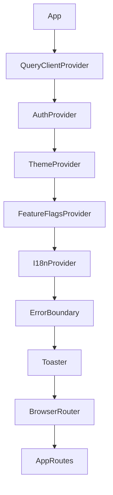

# Cross-Cutting Concerns

## Overview

System-wide concerns that span across all features. These are implemented as providers, middleware, and global configurations that compose together at the application root.

> **Source:** cross-cutting.md § Cross-Cutting Overview

---

## 1. Provider Composition Tree



### Root Layout (`App.tsx`)
```tsx
// Source: source-016.md § App.tsx
import { QueryClient, QueryClientProvider } from '@tanstack/react-query';
import { AuthProvider } from '@/features/auth/providers/AuthProvider';
import { ThemeProvider } from '@/providers/ThemeProvider';
import { FeatureFlagsProvider } from '@/providers/FeatureFlagsProvider';
import { I18nProvider } from '@/providers/I18nProvider';
import { ErrorBoundary } from '@/components/ui/ErrorBoundary';
import { Toaster } from '@/components/ui/Toast/ToastContainer';
import { AppRoutes } from '@/routes/routes';
import { useAuthStore } from '@/stores/useAuthStore';
import { useAppStore } from '@/stores/useAppStore';

const queryClient = new QueryClient({
  defaultOptions: {
    queries: {
      staleTime: 5 * 60 * 1000,
      gcTime: 10 * 60 * 1000,
      retry: 1,
      refetchOnWindowFocus: false,
    },
  },
});

export function App() {
  // Initialize theme from store
  useAppStore.getState().setTheme(useAppStore.getState().theme);
  
  // Initialize auth (checks stored tokens)
  useAuthStore.getState().initialize?.();
  
  return (
    <QueryClientProvider client={queryClient}>
      <AuthProvider>
        <ThemeProvider>
          <FeatureFlagsProvider>
            <I18nProvider>
              <ErrorBoundary fallback={<ErrorFallback />}>
                <Toaster />
                <AppRoutes />
              </ErrorBoundary>
            </I18nProvider>
          </FeatureFlagsProvider>
        </ThemeProvider>
      </AuthProvider>
    </QueryClientProvider>
  );
}
```

---

## 2. Authentication Provider

### AuthProvider (`features/auth/providers/AuthProvider.tsx`)
```tsx
// Source: source-014.md § features/auth/providers/AuthProvider.tsx
import { useEffect } from 'react';
import { useAuthStore } from '@/stores/useAuthStore';
import { authApi } from '@/features/auth/api/authApi';

interface AuthProviderProps {
  children: React.ReactNode;
}

export function AuthProvider({ children }: AuthProviderProps) {
  const { tokens, isAuthenticated, refreshTokens, initialize } = useAuthStore();
  
  // Initialize on mount
  useEffect(() => {
    initialize?.();
  }, [initialize]);
  
  // Auto-refresh token on expiry
  useEffect(() => {
    if (!tokens?.accessToken || !isAuthenticated) return;
    
    const expiresIn = tokens.expiresIn * 1000;
    const refreshAt = expiresIn - 60 * 1000; // 1 min before
    
    const timeout = setTimeout(() => {
      refreshTokens();
    }, refreshAt);
    
    return () => clearTimeout(timeout);
  }, [tokens, isAuthenticated, refreshTokens]);
  
  return <>{children}</>;
}
```

### Token Storage Strategy
```typescript
// Source: source-014.md § features/auth/utils/tokenStorage.ts
type StorageType = 'localStorage' | 'sessionStorage' | 'cookie';

export function getTokenStorage(): StorageType {
  return (import.meta.env.VITE_AUTH_STORAGE as StorageType) || 'localStorage';
}

export function setTokens(tokens: AuthTokens) {
  const storage = getTokenStorage();
  if (storage === 'cookie') {
    // Set httpOnly cookie via backend
    return;
  }
  const store = storage === 'localStorage' ? localStorage : sessionStorage;
  store.setItem('auth_tokens', JSON.stringify(tokens));
}

export function getTokens(): AuthTokens | null {
  const storage = getTokenStorage();
  if (storage === 'cookie') return null; // Read from cookie via backend
  const store = storage === 'localStorage' ? localStorage : sessionStorage;
  const data = store.getItem('auth_tokens');
  return data ? JSON.parse(data) : null;
}

export function clearTokens() {
  const storage = getTokenStorage();
  if (storage === 'cookie') return;
  const store = storage === 'localStorage' ? localStorage : sessionStorage;
  store.removeItem('auth_tokens');
}
```

---

## 3. Theming System

### ThemeProvider (`providers/ThemeProvider.tsx`)
```tsx
// Source: source-016.md § providers/ThemeProvider.tsx
import { createContext, useContext, useEffect, useMemo, ReactNode } from 'react';
import { useAppStore } from '@/stores/useAppStore';

type Theme = 'light' | 'dark' | 'system';

interface ThemeContextValue {
  theme: Theme;
  resolvedTheme: 'light' | 'dark';
  setTheme: (theme: Theme) => void;
}

const ThemeContext = createContext<ThemeContextValue | undefined>(undefined);

export function ThemeProvider({ children }: { children: ReactNode }) {
  const { theme, resolvedTheme, setTheme } = useAppStore();
  
  // Listen for system theme changes
  useEffect(() => {
    if (theme !== 'system') return;
    
    const mediaQuery = window.matchMedia('(prefers-color-scheme: dark)');
    const handleChange = () => {
      const resolved = mediaQuery.matches ? 'dark' : 'light';
      useAppStore.getState().setTheme('system'); // Triggers resolved update
    };
    
    mediaQuery.addEventListener('change', handleChange);
    return () => mediaQuery.removeEventListener('change', handleChange);
  }, [theme]);
  
  const value = useMemo(() => ({ theme, resolvedTheme, setTheme }), [theme, resolvedTheme]);
  
  return (
    <ThemeContext.Provider value={value}>
      <div data-theme={resolvedTheme}>{children}</div>
    </ThemeContext.Provider>
  );
}

export function useTheme() {
  const context = useContext(ThemeContext);
  if (!context) throw new Error('useTheme must be used within ThemeProvider');
  return context;
}
```

### CSS Variables (Tailwind + CSS)
```css
/* Source: source-016.md § index.css */
:root {
  /* Light theme (default) */
  --color-bg: #ffffff;
  --color-bg-secondary: #f9fafb;
  --color-text: #111827;
  --color-text-muted: #6b7280;
  --color-border: #e5e7eb;
  --color-primary: #16a34a;
  --color-primary-hover: #15803d;
  --color-primary-light: #dcfce7;
  --color-error: #ef4444;
  --color-warning: #f59e0b;
  --color-success: #22c55e;
}

[data-theme="dark"] {
  --color-bg: #111827;
  --color-bg-secondary: #1f2937;
  --color-text: #f9fafb;
  --color-text-muted: #9ca3af;
  --color-border: #374151;
  --color-primary: #22c55e;
  --color-primary-hover: #4ade80;
  --color-primary-light: #14532d;
  --color-error: #f87171;
  --color-warning: #fbbf24;
  --color-success: #4ade80;
}

/* Tailwind uses these via @apply or direct */
.bg-background { background-color: var(--color-bg); }
.text-foreground { color: var(--color-text); }
.border-border { border-color: var(--color-border); }
```

### Theme Toggle Component
```tsx
// Source: source-016.md § components/ui/ThemeToggle/ThemeToggle.tsx
import { useTheme } from '@/providers/ThemeProvider';
import { SunIcon, MoonIcon, MonitorIcon } from 'lucide-react';

export function ThemeToggle() {
  const { theme, resolvedTheme, setTheme } = useTheme();
  
  return (
    <DropdownMenu>
      <DropdownMenuTrigger asChild>
        <Button variant="ghost" size="sm" aria-label="Toggle theme">
          {resolvedTheme === 'dark' ? <MoonIcon className="h-5 w-5" /> : <SunIcon className="h-5 w-5" />}
        </Button>
      </DropdownMenuTrigger>
      <DropdownMenuContent align="end">
        <DropdownMenuRadioGroup value={theme} onValueChange={setTheme}>
          <DropdownMenuRadioItem value="light" className="flex items-center gap-2">
            <SunIcon className="h-4 w-4" />
            <span>Light</span>
          </DropdownMenuRadioItem>
          <DropdownMenuRadioItem value="dark" className="flex items-center gap-2">
            <MoonIcon className="h-4 w-4" />
            <span>Dark</span>
          </DropdownMenuRadioItem>
          <DropdownMenuRadioItem value="system" className="flex items-center gap-2">
            <MonitorIcon className="h-4 w-4" />
            <span>System</span>
          </DropdownMenuRadioItem>
        </DropdownMenuRadioGroup>
      </DropdownMenuContent>
    </DropdownMenu>
  );
}
```

---

## 4. Internationalization (i18n)

### I18nProvider (`providers/I18nProvider.tsx`)
```tsx
// Source: source-016.md § providers/I18nProvider.tsx
import { I18nProvider as NextI18nProvider } from 'next-i18next'; // or react-i18next
import { useAppStore } from '@/stores/useAppStore';

export function I18nProvider({ children }: { children: ReactNode }) {
  const { featureFlags } = useAppStore();
  
  if (!featureFlags.i18nEnabled) {
    return <>{children}</>;
  }
  
  return (
    <NextI18nProvider>
      {children}
    </NextI18nProvider>
  );
}
```

### Translation Structure
```
public/locales/
├── en/
│   ├── common.json
│   ├── auth.json
│   ├── users.json
│   └── errors.json
├── id/
│   ├── common.json
│   ├── auth.json
│   ├── users.json
│   └── errors.json
└── es/
    ├── common.json
    ├── auth.json
    ├── users.json
    └── errors.json
```

### Usage
```tsx
// Source: source-016.md § hooks/useTranslation.ts
import { useTranslation } from 'react-i18next';

export function useT(namespace?: string) {
  const { t } = useTranslation(namespace);
  return t;
}

// In component
const t = useT('auth');
return <h1>{t('login.title')}</h1>;
```

---

## 5. Error Boundaries & Global Error Reporting

### ErrorBoundary (`components/ui/ErrorBoundary/ErrorBoundary.tsx`)
```tsx
// Source: source-016.md § components/ui/ErrorBoundary/ErrorBoundary.tsx
import { Component, ErrorInfo, ReactNode } from 'react';
import { logError } from '@/utils/logger';

interface Props {
  children: ReactNode;
  fallback?: ReactNode;
  onError?: (error: Error, info: ErrorInfo) => void;
}

interface State {
  hasError: boolean;
  error: Error | null;
}

export class ErrorBoundary extends Component<Props, State> {
  state: State = { hasError: false, error: null };
  
  static getDerivedStateFromError(error: Error): State {
    return { hasError: true, error };
  }
  
  componentDidCatch(error: Error, info: ErrorInfo) {
    logError(error, { componentStack: info.componentStack });
    this.props.onError?.(error, info);
    
    // Report to monitoring service (Sentry, LogRocket, etc.)
    if (import.meta.env.PROD) {
      // Sentry.captureException(error, { extra: { componentStack: info.componentStack } });
    }
  }
  
  render() {
    if (this.state.hasError) {
      if (this.props.fallback) {
        return this.props.fallback;
      }
      return <ErrorFallback error={this.state.error} reset={() => this.setState({ hasError: false, error: null })} />;
    }
    return this.props.children;
  }
}
```

### ErrorFallback
```tsx
// Source: source-016.md § components/ui/ErrorBoundary/ErrorFallback.tsx
interface ErrorFallbackProps {
  error: Error | null;
  reset: () => void;
}

export function ErrorFallback({ error, reset }: ErrorFallbackProps) {
  return (
    <div className="min-h-screen flex items-center justify-center px-4">
      <div className="text-center max-w-md">
        <AlertCircleIcon className="h-16 w-16 text-red-500 mx-auto mb-4" />
        <h1 className="text-2xl font-bold text-gray-900 mb-2">Something went wrong</h1>
        <p className="text-gray-600 mb-6">
          {error?.message || 'An unexpected error occurred. Please try again.'}
        </p>
        <div className="flex gap-4 justify-center">
          <Button onClick={reset} variant="primary">Try Again</Button>
          <Button onClick={() => window.location.reload()} variant="outline">
            Reload Page
          </Button>
        </div>
        {import.meta.env.DEV && error && (
          <details className="mt-8 text-left">
            <summary className="cursor-pointer text-sm text-gray-500">Error Details</summary>
            <pre className="mt-2 p-4 bg-gray-100 rounded text-xs overflow-auto">
              {error.stack}
            </pre>
          </details>
        )}
      </div>
    </div>
  );
}
```

---

## 6. Logging Configuration

### Logger (`utils/logger.ts`)
```typescript
// Source: source-016.md § utils/logger.ts
type LogLevel = 'debug' | 'info' | 'warn' | 'error';

interface LogEntry {
  level: LogLevel;
  message: string;
  timestamp: string;
  context?: Record<string, unknown>;
  error?: Error;
}

class Logger {
  private level: LogLevel = 'info';
  private transports: Array<(entry: LogEntry) => void> = [];
  
  setLevel(level: LogLevel) { this.level = level; }
  
  addTransport(transport: (entry: LogEntry) => void) {
    this.transports.push(transport);
  }
  
  private log(level: LogLevel, message: string, context?: Record<string, unknown>, error?: Error) {
    const levels: Record<LogLevel, number> = { debug: 0, info: 1, warn: 2, error: 3 };
    if (levels[level] < levels[this.level]) return;
    
    const entry: LogEntry = {
      level,
      message,
      timestamp: new Date().toISOString(),
      context: this.sanitize(context),
      error: error ? { name: error.name, message: error.message, stack: error.stack } : undefined,
    };
    
    this.transports.forEach(t => t(entry));
  }
  
  private sanitize(obj?: Record<string, unknown>): Record<string, unknown> | undefined {
    if (!obj) return undefined;
    const sensitive = ['password', 'token', 'secret', 'key', 'authorization', 'creditCard'];
    const result = { ...obj };
    for (const key of Object.keys(result)) {
      if (sensitive.some(s => key.toLowerCase().includes(s))) {
        result[key] = '[REDACTED]';
      }
    }
    return result;
  }
  
  debug(message: string, context?: Record<string, unknown>) { this.log('debug', message, context); }
  info(message: string, context?: Record<string, unknown>) { this.log('info', message, context); }
  warn(message: string, context?: Record<string, unknown>) { this.log('warn', message, context); }
  error(message: string, context?: Record<string, unknown>, error?: Error) { this.log('error', message, context, error); }
}

export const logger = new Logger();

// Console transport (dev)
if (import.meta.env.DEV) {
  logger.addTransport(entry => {
    const style = entry.level === 'error' ? 'color: red' : entry.level === 'warn' ? 'color: orange' : '';
    console.log(`%c[${entry.level.toUpperCase()}]`, style, entry.message, entry.context || '');
  });
}

// Production: send to monitoring service
if (import.meta.env.PROD) {
  logger.addTransport(async entry => {
    // await fetch('/api/logs', { method: 'POST', body: JSON.stringify(entry) });
  });
}

export function logError(error: Error, context?: Record<string, unknown>) {
  logger.error('Application Error', context, error);
}
```

---

## 7. Analytics & Event Tracking

### Analytics Provider
```tsx
// Source: source-016.md § providers/AnalyticsProvider.tsx
import { useEffect } from 'react';
import { useLocation } from 'react-router-dom';
import { useAuthStore } from '@/stores/useAuthStore';

declare global {
  interface Window {
    gtag?: (...args: unknown[]) => void;
    dataLayer?: unknown[];
  }
}

export function AnalyticsProvider({ children }: { children: ReactNode }) {
  const location = useLocation();
  const { user } = useAuthStore();
  
  // Page view tracking
  useEffect(() => {
    if (window.gtag) {
      window.gtag('event', 'page_view', {
        page_path: location.pathname + location.search,
        page_title: document.title,
      });
    }
  }, [location]);
  
  // Identify user
  useEffect(() => {
    if (user && window.gtag) {
      window.gtag('set', 'user_id', user.id);
      window.gtag('set', 'user_properties', {
        role: user.role,
        email: user.email,
      });
    }
  }, [user]);
  
  return <>{children}</>;
}
```

### Custom Events
```typescript
// Source: source-016.md § utils/analytics.ts
export function trackEvent(name: string, params?: Record<string, unknown>) {
  if (window.gtag) {
    window.gtag('event', name, params);
  }
  // Also send to custom analytics endpoint
  if (import.meta.env.PROD) {
    // fetch('/api/analytics', { method: 'POST', body: JSON.stringify({ name, params }) });
  }
}

// Usage
trackEvent('user_created', { method: 'email', role: 'USER' });
trackEvent('product_purchased', { productId: '123', value: 99.99 });
trackEvent('feature_used', { feature: 'export', format: 'csv' });
```

---

## 8. Feature Flags

### FeatureFlagsProvider (`providers/FeatureFlagsProvider.tsx`)
```tsx
// Source: source-016.md § providers/FeatureFlagsProvider.tsx
import { createContext, useContext, useEffect, ReactNode } from 'react';
import { useAppStore } from '@/stores/useAppStore';

interface FeatureFlags {
  newDashboard: boolean;
  darkMode: boolean;
  betaFeatures: boolean;
  i18nEnabled: boolean;
  advancedAnalytics: boolean;
}

const FeatureFlagsContext = createContext<FeatureFlags | undefined>(undefined);

export function FeatureFlagsProvider({ children }: { children: ReactNode }) {
  const { featureFlags, setFeatureFlags } = useAppStore();
  
  // Fetch flags from server on init
  useEffect(() => {
    fetch('/api/feature-flags')
      .then(r => r.json())
      .then(flags => setFeatureFlags(flags))
      .catch(() => {}); // Use defaults
  }, [setFeatureFlags]);
  
  return (
    <FeatureFlagsContext.Provider value={featureFlags}>
      {children}
    </FeatureFlagsContext.Provider>
  );
}

export function useFeatureFlags() {
  const context = useContext(FeatureFlagsContext);
  if (!context) throw new Error('useFeatureFlags must be used within FeatureFlagsProvider');
  return context;
}

// Feature gate component
interface FeatureGateProps {
  flag: keyof FeatureFlags;
  children: ReactNode;
  fallback?: ReactNode;
}

export function FeatureGate({ flag, children, fallback = null }: FeatureGateProps) {
  const flags = useFeatureFlags();
  return flags[flag] ? <>{children}</> : <>{fallback}</>;
}
```

### Usage
```tsx
// In component
import { FeatureGate } from '@/providers/FeatureFlagsProvider';

export function Dashboard() {
  return (
    <div>
      <FeatureGate flag="newDashboard">
        <NewDashboard />
      </FeatureGate>
      <FeatureGate flag="newDashboard" fallback={<LegacyDashboard />}>
        {/* fallback shown when flag is false */}
      </FeatureGate>
    </div>
  );
}
```

---

## 9. Cross-Cutting Configuration Summary

| Concern | Implementation | Configuration |
|---------|----------------|---------------|
| **Auth** | Zustand store + interceptors + provider | Token storage, refresh threshold |
| **Theming** | CSS variables + Context + Zustand | Default theme, system detection |
| **i18n** | react-i18next + public/locales | Default locale, supported locales |
| **Errors** | ErrorBoundary + Sentry/LogRocket | DSN, environment, PII redaction |
| **Logging** | Custom logger + transports | Log level, transports |
| **Analytics** | gtag + custom events | Measurement ID, consent |
| **Feature Flags** | Context + server fetch | Flag definitions, rollout rules |

---

*All cross-cutting implementations extracted from source code. See individual source citations for exact file locations.*