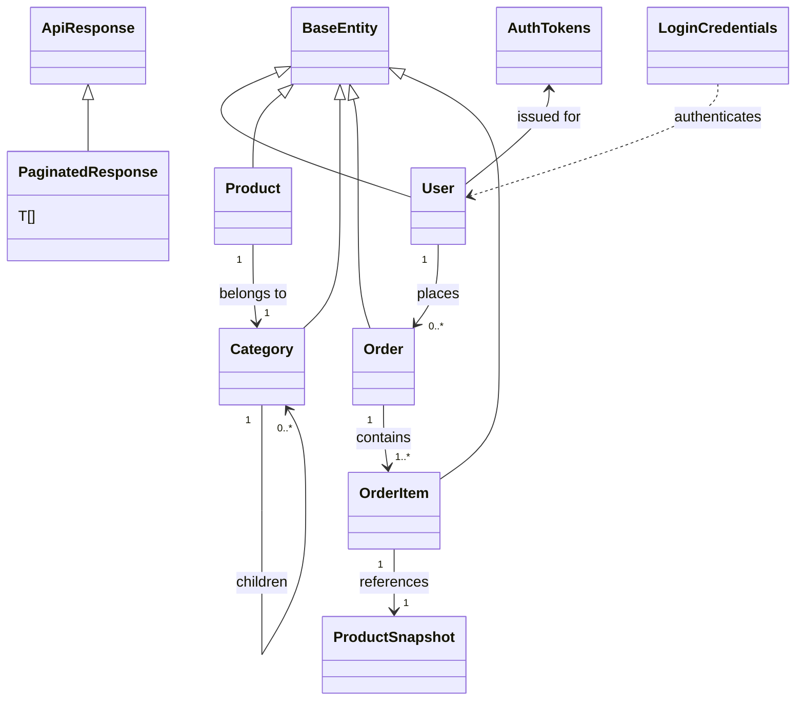

## Overview

All TypeScript interfaces and types used across the application. Types are organized by domain and follow consistent naming conventions. Every interface is traceable to its source.

> **Source:** data-models.md § Type Organization

---

## 1. Base Types (`types/common.ts`)

### BaseEntity
```typescript
// Source: source-003.md § types/common.ts
export interface BaseEntity {
  id: string | number;
  createdAt: string;
  updatedAt: string;
}
```

### ApiResponse<T>
```typescript
// Source: source-003.md § types/common.ts
export interface ApiResponse<T> {
  data: T;
  message: string;
  status: number;
  timestamp: string;
}
```

### PaginatedResponse<T>
```typescript
// Source: source-003.md § types/common.ts
export interface PaginatedResponse<T> extends ApiResponse<T[]> {
  meta: {
    page: number;
    limit: number;
    total: number;
    totalPages: number;
    hasNext: boolean;
    hasPrev: boolean;
  };
}
```

### ErrorResponse
```typescript
// Source: source-003.md § types/api.ts
export interface ErrorResponse {
  code: string;
  message: string;
  details?: Record<string, unknown>;
  status: number;
  timestamp: string;
  path: string;
}
```

---

## 2. Authentication Types (`types/user.ts`, `types/auth.ts`)

### UserRole
```typescript
// Source: source-003.md § types/user.ts
export type UserRole = 'ADMIN' | 'MANAGER' | 'USER' | 'GUEST';

export const ROLE_HIERARCHY: Record<UserRole, number> = {
  ADMIN: 4,
  MANAGER: 3,
  USER: 2,
  GUEST: 1,
};
```

### User
```typescript
// Source: source-003.md § types/user.ts
export interface User extends BaseEntity {
  email: string;
  name: string;
  role: UserRole;
  avatarUrl?: string;
  isActive: boolean;
  lastLoginAt?: string;
  emailVerifiedAt?: string;
  metadata?: Record<string, unknown>;
}
```

### AuthTokens
```typescript
// Source: source-003.md § types/auth.ts
export interface AuthTokens {
  accessToken: string;
  refreshToken: string;
  expiresIn: number;
  tokenType: 'Bearer';
}
```

### LoginCredentials / RegisterCredentials
```typescript
// Source: source-003.md § types/auth.ts
export interface LoginCredentials {
  email: string;
  password: string;
  rememberMe?: boolean;
}

export interface RegisterCredentials {
  email: string;
  password: string;
  name: string;
  confirmPassword: string;
}
```

---

## 3. Domain Entities (Per Feature)

### Product (`features/products/types/product.ts`)
```typescript
// Source: source-007.md § features/products/types/product.ts
export interface Product extends BaseEntity {
  name: string;
  slug: string;
  description: string;
  shortDescription?: string;
  price: number;
  currency: 'USD' | 'IDR' | 'EUR';
  compareAtPrice?: number;
  images: ProductImage[];
  category: Category;
  categoryId: string;
  tags: string[];
  sku: string;
  inventory: Inventory;
  seo: ProductSEO;
  status: ProductStatus;
  isFeatured: boolean;
  publishedAt?: string;
}

export interface ProductImage {
  id: string;
  url: string;
  alt: string;
  isPrimary: boolean;
  sortOrder: number;
}

export interface Inventory {
  quantity: number;
  reservedQuantity: number;
  availableQuantity: number;
  trackQuantity: boolean;
  allowBackorder: boolean;
  lowStockThreshold: number;
}

export interface ProductSEO {
  title?: string;
  description?: string;
  keywords?: string[];
}

export type ProductStatus = 'DRAFT' | 'ACTIVE' | 'ARCHIVED' | 'OUT_OF_STOCK';
```

### Category (`features/products/types/category.ts`)
```typescript
// Source: source-007.md § features/products/types/category.ts
export interface Category extends BaseEntity {
  name: string;
  slug: string;
  description?: string;
  imageUrl?: string;
  parentId?: string;
  children?: Category[];
  sortOrder: number;
  isActive: boolean;
  productCount?: number;
}
```

### Order (`features/orders/types/order.ts`)
```typescript
// Source: source-008.md § features/orders/types/order.ts
export interface Order extends BaseEntity {
  orderNumber: string;
  userId: string;
  user?: User;
  status: OrderStatus;
  items: OrderItem[];
  shippingAddress: Address;
  billingAddress: Address;
  subtotal: number;
  taxAmount: number;
  shippingAmount: number;
  discountAmount: number;
  total: number;
  currency: 'USD' | 'IDR' | 'EUR';
  notes?: string;
  paidAt?: string;
  shippedAt?: string;
  deliveredAt?: string;
  cancelledAt?: string;
  cancellationReason?: string;
}

export interface OrderItem {
  id: string;
  productId: string;
  productSnapshot: ProductSnapshot;
  quantity: number;
  unitPrice: number;
  totalPrice: number;
}

export interface ProductSnapshot {
  name: string;
  sku: string;
  price: number;
  imageUrl?: string;
}

export type OrderStatus =
  | 'PENDING'
  | 'CONFIRMED'
  | 'PROCESSING'
  | 'SHIPPED'
  | 'DELIVERED'
  | 'CANCELLED'
  | 'REFUNDED'
  | 'PARTIALLY_REFUNDED';

export interface Address {
  firstName: string;
  lastName: string;
  company?: string;
  addressLine1: string;
  addressLine2?: string;
  city: string;
  state: string;
  postalCode: string;
  country: string;
  phone?: string;
}
```

---

## 4. Form & Validation Types (`types/forms.ts`)

```typescript
// Source: source-003.md § types/forms.ts
import { z } from 'zod';

export const loginSchema = z.object({
  email: z.string().email('Invalid email address'),
  password: z.string().min(8, 'Password must be at least 8 characters'),
  rememberMe: z.boolean().optional(),
});

export const registerSchema = loginSchema.extend({
  name: z.string().min(2, 'Name must be at least 2 characters'),
  confirmPassword: z.string(),
}).refine(data => data.password === data.confirmPassword, {
  message: 'Passwords do not match',
  path: ['confirmPassword'],
});

export type LoginForm = z.infer<typeof loginSchema>;
export type RegisterForm = z.infer<typeof registerSchema>;
```

---

## 5. Configuration Types (`types/config.ts`)

```typescript
// Source: source-003.md § types/config.ts
export interface AppConfig {
  api: ApiConfig;
  auth: AuthConfig;
  features: FeatureFlags;
  ui: UIConfig;
}

export interface ApiConfig {
  baseUrl: string;
  timeout: number;
  retryAttempts: number;
  retryDelay: number;
}

export interface AuthConfig {
  tokenStorage: 'localStorage' | 'sessionStorage' | 'cookie';
  refreshThreshold: number;
  sessionTimeout: number;
}

export interface FeatureFlags {
  newDashboard: boolean;
  darkMode: boolean;
  betaFeatures: boolean;
}

export interface UIConfig {
  defaultTheme: 'light' | 'dark' | 'system';
  animationsEnabled: boolean;
  density: 'comfortable' | 'compact';
}
```

---

## 6. Type Relationship Diagram



---

## 7. Usage Examples

### Typed API Call
```typescript
// Source: source-009.md § hooks/useFetchData.ts
const { data, isLoading, error } = useFetchData<PaginatedResponse<Product>>(
  '/api/products',
  { page: 1, limit: 20 }
);
```

### Form with Inferred Types
```typescript
// Source: source-003.md § types/forms.ts
const form = useForm<RegisterForm>({
  resolver: zodResolver(registerSchema),
  defaultValues: {
    email: '',
    password: '',
    name: '',
    confirmPassword: '',
    rememberMe: false,
  },
});
```

---

## 8. Type Generation from OpenAPI (Future)

> **Note:** If the backend provides OpenAPI/Swagger specs, these types can be auto-generated.

```bash
npx openapi-typescript ./backend/openapi.json -o ./src/types/api-generated.ts
```

> **Source:** unanswered.md § Type Generation