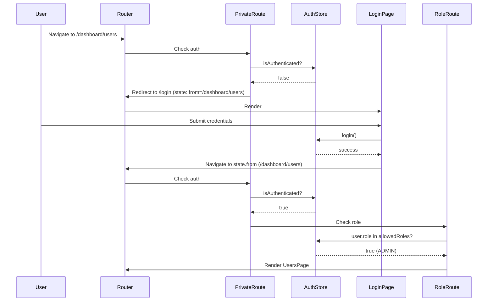

# Routing & Layout Structure

## Overview

The application uses **React Router v6** with a layout-driven routing architecture. Routes are organized by layout type (Public, Auth, Protected) with role-based access control and lazy loading for code splitting.

> **Source:** routing-structure.md § Routing Architecture

---

## 1. Route Tree

```mermaid
graph TD
    Root[/] --> PublicRoutes[Public Routes]
    Root --> AuthRoutes[Auth Routes]
    Root --> ProtectedRoutes[Protected Routes]
    
    PublicRoutes --> PublicLayout[PublicLayout]
    PublicLayout --> Landing[/]
    PublicLayout --> About[/about]
    PublicLayout --> Pricing[/pricing]
    PublicLayout --> Contact[/contact]
    PublicLayout --> NotFound[*]
    
    AuthRoutes --> AuthLayout[AuthLayout]
    AuthLayout --> Login[/login]
    AuthLayout --> Register[/register]
    AuthLayout --> ForgotPassword[/forgot-password]
    AuthLayout --> ResetPassword[/reset-password/:token]
    
    ProtectedRoutes --> ProtectedLayout[ProtectedLayout]
    ProtectedLayout --> Dashboard[/dashboard]
    ProtectedLayout --> Users[/dashboard/users]
    ProtectedLayout --> UsersNew[/dashboard/users/new]
    ProtectedLayout --> UsersEdit[/dashboard/users/:id/edit]
    ProtectedLayout --> Products[/dashboard/products]
    ProtectedLayout --> ProductsNew[/dashboard/products/new]
    ProtectedLayout --> ProductsEdit[/dashboard/products/:id/edit]
    ProtectedLayout --> Orders[/dashboard/orders]
    ProtectedLayout --> OrdersDetail[/dashboard/orders/:id]
    ProtectedLayout --> Settings[/dashboard/settings]
    ProtectedLayout --> Profile[/dashboard/profile]
```

---

## 2. Route Configuration (`routes/routes.tsx`)

```tsx
// Source: source-012.md § routes/routes.tsx
import { BrowserRouter, Routes, Route, Navigate } from 'react-router-dom';
import { LazyPage } from '@/components/ui/LazyPage';

// Layouts
import { PublicLayout } from '@/components/layout/PublicLayout';
import { AuthLayout } from '@/components/layout/AuthLayout';
import { ProtectedLayout } from '@/components/layout/ProtectedLayout';

// Guards
import { PublicRoute } from '@/routes/guards/PublicRoute';
import { PrivateRoute } from '@/routes/guards/PrivateRoute';
import { RoleRoute } from '@/routes/guards/RoleRoute';

// Pages (Lazy Loaded)
const LandingPage = LazyPage(() => import('@/pages/public/LandingPage'));
const AboutPage = LazyPage(() => import('@/pages/public/AboutPage'));
const PricingPage = LazyPage(() => import('@/pages/public/PricingPage'));
const ContactPage = LazyPage(() => import('@/pages/public/ContactPage'));
const NotFoundPage = LazyPage(() => import('@/pages/public/NotFoundPage'));

const LoginPage = LazyPage(() => import('@/pages/auth/LoginPage'));
const RegisterPage = LazyPage(() => import('@/pages/auth/RegisterPage'));
const ForgotPasswordPage = LazyPage(() => import('@/pages/auth/ForgotPasswordPage'));
const ResetPasswordPage = LazyPage(() => import('@/pages/auth/ResetPasswordPage'));

const DashboardHome = LazyPage(() => import('@/pages/dashboard/DashboardHome'));
const UsersPage = LazyPage(() => import('@/pages/dashboard/UsersPage'));
const UserNewPage = LazyPage(() => import('@/pages/dashboard/UserNewPage'));
const UserEditPage = LazyPage(() => import('@/pages/dashboard/UserEditPage'));
const ProductsPage = LazyPage(() => import('@/pages/dashboard/ProductsPage'));
const ProductNewPage = LazyPage(() => import('@/pages/dashboard/ProductNewPage'));
const ProductEditPage = LazyPage(() => import('@/pages/dashboard/ProductEditPage'));
const OrdersPage = LazyPage(() => import('@/pages/dashboard/OrdersPage'));
const OrderDetailPage = LazyPage(() => import('@/pages/dashboard/OrderDetailPage'));
const SettingsPage = LazyPage(() => import('@/pages/dashboard/SettingsPage'));
const ProfilePage = LazyPage(() => import('@/pages/dashboard/ProfilePage'));

export function AppRoutes() {
  return (
    <BrowserRouter>
      <Routes>
        {/* ===== PUBLIC ROUTES ===== */}
        <Route element={<PublicLayout />}>
          <Route index element={<LandingPage />} />
          <Route path="about" element={<AboutPage />} />
          <Route path="pricing" element={<PricingPage />} />
          <Route path="contact" element={<ContactPage />} />
          <Route path="*" element={<NotFoundPage />} />
        </Route>

        {/* ===== AUTH ROUTES (Guest Only) ===== */}
        <Route element={<PublicRoute><AuthLayout /></PublicRoute>}>
          <Route path="login" element={<LoginPage />} />
          <Route path="register" element={<RegisterPage />} />
          <Route path="forgot-password" element={<ForgotPasswordPage />} />
          <Route path="reset-password/:token" element={<ResetPasswordPage />} />
        </Route>

        {/* ===== PROTECTED ROUTES (Auth Required) ===== */}
        <Route element={<PrivateRoute><ProtectedLayout /></PrivateRoute>}>
          <Route path="dashboard" element={<DashboardHome />} />
          
          {/* Users - Admin/Manager only */}
          <Route element={<RoleRoute allowedRoles={['ADMIN', 'MANAGER']} />}>
            <Route path="dashboard/users" element={<UsersPage />} />
            <Route path="dashboard/users/new" element={<UserNewPage />} />
            <Route path="dashboard/users/:id/edit" element={<UserEditPage />} />
          </Route>
          
          {/* Products - All authenticated */}
          <Route path="dashboard/products" element={<ProductsPage />} />
          <Route path="dashboard/products/new" element={<ProductNewPage />} />
          <Route path="dashboard/products/:id/edit" element={<ProductEditPage />} />
          
          {/* Orders - All authenticated */}
          <Route path="dashboard/orders" element={<OrdersPage />} />
          <Route path="dashboard/orders/:id" element={<OrderDetailPage />} />
          
          {/* Settings & Profile - All authenticated */}
          <Route path="dashboard/settings" element={<SettingsPage />} />
          <Route path="dashboard/profile" element={<ProfilePage />} />
        </Route>
      </Routes>
    </BrowserRouter>
  );
}
```

---

## 3. Layout Mapping

| Route Pattern | Layout | Guard | Description |
|---------------|--------|-------|-------------|
| `/`, `/about`, `/pricing`, `/contact` | `PublicLayout` | None | Marketing pages |
| `/login`, `/register`, `/forgot-password`, `/reset-password/:token` | `AuthLayout` | `PublicRoute` | Auth pages (redirect if logged in) |
| `/dashboard/*` | `ProtectedLayout` | `PrivateRoute` | App shell (redirect if not logged in) |
| `/dashboard/users/*` | `ProtectedLayout` | `PrivateRoute` + `RoleRoute` | Admin/Manager only |

---

## 4. Route Guards

### PublicRoute (Redirects Authenticated Users)
```tsx
// Source: source-012.md § routes/guards/PublicRoute.tsx
import { Navigate, useLocation } from 'react-router-dom';
import { useAuthStore } from '@/stores/useAuthStore';

interface PublicRouteProps {
  children: React.ReactNode;
}

export function PublicRoute({ children }: PublicRouteProps) {
  const { isAuthenticated } = useAuthStore();
  const location = useLocation();
  
  if (isAuthenticated) {
    const from = location.state?.from?.pathname || '/dashboard';
    return <Navigate to={from} replace state={{ from: location }} />;
  }
  
  return <>{children}</>;
}
```

### PrivateRoute (Redirects Unauthenticated Users)
```tsx
// Source: source-012.md § routes/guards/PrivateRoute.tsx
import { Navigate, useLocation } from 'react-router-dom';
import { useAuthStore } from '@/stores/useAuthStore';

interface PrivateRouteProps {
  children: React.ReactNode;
}

export function PrivateRoute({ children }: PrivateRouteProps) {
  const { isAuthenticated, isLoading } = useAuthStore();
  const location = useLocation();
  
  if (isLoading) {
    return <PageSkeleton />;
  }
  
  if (!isAuthenticated) {
    return (
      <Navigate 
        to="/login" 
        replace 
        state={{ from: location }} 
      />
    );
  }
  
  return <>{children}</>;
}
```

### RoleRoute (Role-Based Access Control)
```tsx
// Source: source-012.md § routes/guards/RoleRoute.tsx
import { Navigate } from 'react-router-dom';
import { useAuthStore } from '@/stores/useAuthStore';

interface RoleRouteProps {
  children: React.ReactNode;
  allowedRoles: UserRole[];
}

export function RoleRoute({ children, allowedRoles }: RoleRouteProps) {
  const { user, isAuthenticated } = useAuthStore();
  
  if (!isAuthenticated) {
    return <Navigate to="/login" replace />;
  }
  
  if (!user || !allowedRoles.includes(user.role)) {
    return <Navigate to="/unauthorized" replace />;
  }
  
  return <>{children}</>;
}
```

---

## 5. Lazy Loading & Suspense

### LazyPage Wrapper
```tsx
// Source: source-012.md § components/ui/LazyPage.tsx
import { Suspense, lazy, ComponentType } from 'react';
import { PageSkeleton } from './PageSkeleton';

export function LazyPage<T extends ComponentType<any>>(
  importFn: () => Promise<{ default: T }>
) {
  const Component = lazy(importFn);
  
  return function LazyPageWrapper(props: React.ComponentProps<T>) {
    return (
      <Suspense fallback={<PageSkeleton />}>
        <Component {...props} />
      </Suspense>
    );
  };
}
```

### PageSkeleton
```tsx
// Source: source-012.md § components/ui/PageSkeleton.tsx
export function PageSkeleton() {
  return (
    <div className="animate-pulse space-y-6">
      <div className="h-8 w-1/4 bg-gray-200 rounded" />
      <div className="grid gap-4 md:grid-cols-2 lg:grid-cols-3">
        {[...Array(6)].map((_, i) => (
          <div key={i} className="h-32 bg-gray-200 rounded-lg" />
        ))}
      </div>
      <div className="h-64 bg-gray-200 rounded-lg" />
    </div>
  );
}
```

---

## 6. Navigation Flow



---

## 7. Route Metadata

```typescript
// Source: source-012.md § routes/routeTree.ts
export interface RouteMeta {
  title: string;
  description?: string;
  breadcrumb?: string;
  requiredPermissions?: string[];
  roles?: UserRole[];
  layout?: 'public' | 'auth' | 'protected';
  icon?: string;
  hiddenInNav?: boolean;
}

export const routeMeta: Record<string, RouteMeta> = {
  '/': { title: 'Home', breadcrumb: 'Home', layout: 'public' },
  '/about': { title: 'About Us', breadcrumb: 'About', layout: 'public' },
  '/pricing': { title: 'Pricing', breadcrumb: 'Pricing', layout: 'public' },
  '/login': { title: 'Sign In', breadcrumb: 'Sign In', layout: 'auth' },
  '/register': { title: 'Sign Up', breadcrumb: 'Sign Up', layout: 'auth' },
  '/dashboard': { title: 'Dashboard', breadcrumb: 'Dashboard', layout: 'protected', icon: 'home' },
  '/dashboard/users': { 
    title: 'Users', 
    breadcrumb: 'Users', 
    layout: 'protected', 
    roles: ['ADMIN', 'MANAGER'],
    icon: 'users' 
  },
  '/dashboard/users/new': { 
    title: 'New User', 
    breadcrumb: 'New User', 
    layout: 'protected', 
    roles: ['ADMIN', 'MANAGER'],
    hiddenInNav: true 
  },
  '/dashboard/users/:id/edit': { 
    title: 'Edit User', 
    breadcrumb: 'Edit User', 
    layout: 'protected', 
    roles: ['ADMIN', 'MANAGER'],
    hiddenInNav: true 
  },
  '/dashboard/products': { title: 'Products', breadcrumb: 'Products', layout: 'protected', icon: 'box' },
  '/dashboard/orders': { title: 'Orders', breadcrumb: 'Orders', layout: 'protected', icon: 'shopping-cart' },
  '/dashboard/settings': { title: 'Settings', breadcrumb: 'Settings', layout: 'protected', icon: 'cog' },
  '/dashboard/profile': { title: 'Profile', breadcrumb: 'Profile', layout: 'protected', icon: 'user', hiddenInNav: true },
};
```

### Usage in Breadcrumbs
```tsx
// Source: source-012.md § components/layout/Breadcrumbs/Breadcrumbs.tsx
import { useLocation, useRoutes } from 'react-router-dom';
import { routeMeta } from '@/routes/routeTree';

export function Breadcrumbs() {
  const location = useLocation();
  const pathnames = location.pathname.split('/').filter(Boolean);
  
  const breadcrumbs = pathnames.map((segment, index) => {
    const path = '/' + pathnames.slice(0, index + 1).join('/');
    const meta = routeMeta[path] || routeMeta[path.replace(/\/[^/]+$/, '/:id')];
    return { path, label: meta?.breadcrumb || segment };
  });
  
  return (
    <nav aria-label="Breadcrumb" className="flex items-center gap-2 text-sm">
      {breadcrumbs.map((crumb, i) => (
        <span key={crumb.path} className="flex items-center gap-2">
          {i > 0 && <ChevronRightIcon className="h-4 w-4 text-gray-400" />}
          {i === breadcrumbs.length - 1 ? (
            <span className="font-medium text-gray-900">{crumb.label}</span>
          ) : (
            <Link to={crumb.path} className="text-gray-500 hover:text-gray-700">
              {crumb.label}
            </Link>
          )}
        </span>
      ))}
    </nav>
  );
}
```

---

## 8. Programmatic Navigation

### Navigation Hook
```typescript
// Source: source-012.md § hooks/useNavigation.ts
import { useNavigate, useLocation } from 'react-router-dom';

export function useNavigation() {
  const navigate = useNavigate();
  const location = useLocation();
  
  return {
    goBack: () => navigate(-1),
    goForward: () => navigate(1),
    goTo: (path: string, options?: { replace?: boolean; state?: any }) => {
      navigate(path, options);
    },
    goToLogin: (from?: string) => {
      navigate('/login', { 
        state: { from: from || location.pathname },
        replace: true 
      });
    },
    goToDashboard: () => navigate('/dashboard'),
    goToUserEdit: (id: string) => navigate(`/dashboard/users/${id}/edit`),
    goToProductEdit: (id: string) => navigate(`/dashboard/products/${id}/edit`),
    goToOrderDetail: (id: string) => navigate(`/dashboard/orders/${id}`),
  };
}
```

---

## 9. 404 & Error Handling

```tsx
// Source: source-012.md § routes/routes.tsx (catch-all)
<Route element={<PrivateRoute><ProtectedLayout /></PrivateRoute>}>
  {/* ... protected routes */}
</Route>

// Global catch-all for unmatched routes
<Route path="*" element={<NotFoundPage />} />
```

### NotFoundPage
```tsx
// Source: source-012.md § pages/public/NotFoundPage.tsx
import { Link } from 'react-router-dom';

export function NotFoundPage() {
  return (
    <AuthLayout title="Page Not Found" subtitle="Sorry, we couldn't find the page you're looking for.">
      <div className="text-center space-y-6">
        <div className="text-9xl font-bold text-gray-200">404</div>
        <Link to="/" className="btn btn-primary inline-block">
          Go Home
        </Link>
      </div>
    </AuthLayout>
  );
}
```

---

## 10. Route Constants (Type-Safe)

```typescript
// Source: source-012.md § routes/constants.ts
export const ROUTES = {
  // Public
  HOME: '/',
  ABOUT: '/about',
  PRICING: '/pricing',
  CONTACT: '/contact',
  
  // Auth
  LOGIN: '/login',
  REGISTER: '/register',
  FORGOT_PASSWORD: '/forgot-password',
  RESET_PASSWORD: (token: string) => `/reset-password/${token}`,
  
  // Protected
  DASHBOARD: '/dashboard',
  USERS: '/dashboard/users',
  USER_NEW: '/dashboard/users/new',
  USER_EDIT: (id: string) => `/dashboard/users/${id}/edit`,
  PRODUCTS: '/dashboard/products',
  PRODUCT_NEW: '/dashboard/products/new',
  PRODUCT_EDIT: (id: string) => `/dashboard/products/${id}/edit`,
  ORDERS: '/dashboard/orders',
  ORDER_DETAIL: (id: string) => `/dashboard/orders/${id}`,
  SETTINGS: '/dashboard/settings',
  PROFILE: '/dashboard/profile',
  
  // Errors
  UNAUTHORIZED: '/unauthorized',
} as const;

// Usage: navigate(ROUTES.USER_EDIT(userId))
```