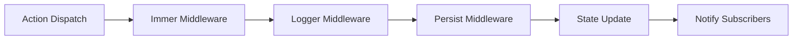

## Overview

This application uses **Zustand** for global state management — a lightweight, TypeScript-first solution with minimal boilerplate. State is organized into domain-specific stores with clear boundaries and persistence strategies.

> **Source:** state-management.md § State Management Philosophy

---

## 1. Store Architecture

```
stores/
├── useAuthStore.ts      # Authentication & user session
├── useAppStore.ts       # App-wide UI state (theme, sidebar, toasts)
├── useFeatureStore.ts   # Feature-specific stores (lazy-loaded)
├── middleware/
│   ├── persist.ts       # Persist middleware configuration
│   ├── logger.ts        # Development logging
│   └── immer.ts         # Immutable updates with Immer
└── index.ts             # Barrel exports
```

---

## 2. Auth Store (`stores/useAuthStore.ts`)

### State Shape
```typescript
// Source: source-010.md § stores/useAuthStore.ts
interface AuthState {
  // State
  user: User | null;
  tokens: AuthTokens | null;
  isAuthenticated: boolean;
  isLoading: boolean;
  error: ErrorResponse | null;
  
  // Computed (selectors)
  permissions: string[];
  isAdmin: boolean;
  isManager: boolean;
  
  // Actions
  login: (credentials: LoginCredentials) => Promise<void>;
  register: (data: RegisterCredentials) => Promise<void>;
  logout: () => void;
  refreshTokens: () => Promise<void>;
  updateUser: (user: Partial<User>) => void;
  clearError: () => void;
  setLoading: (loading: boolean) => void;
}
```

### Implementation
```typescript
// Source: source-010.md § stores/useAuthStore.ts
import { create } from 'zustand';
import { persist, createJSONStorage } from 'zustand/middleware';
import { immer } from 'zustand/middleware/immer';
import { authApi } from '@/features/auth/api/authApi';

export const useAuthStore = create<AuthState>()(
  persist(
    immer((set, get) => ({
      // Initial state
      user: null,
      tokens: null,
      isAuthenticated: false,
      isLoading: false,
      error: null,
      
      // Selectors (derived state)
      get permissions() {
        const { user } = get();
        if (!user) return [];
        return ROLE_PERMISSIONS[user.role] || [];
      },
      
      get isAdmin() {
        const { user } = get();
        return user?.role === 'ADMIN';
      },
      
      get isManager() {
        const { user } = get();
        return user?.role === 'ADMIN' || user?.role === 'MANAGER';
      },
      
      // Actions
      login: async (credentials) => {
        set(state => { state.isLoading = true; state.error = null; });
        try {
          const response = await authApi.login(credentials);
          set(state => {
            state.user = response.data.user;
            state.tokens = response.data.tokens;
            state.isAuthenticated = true;
            state.isLoading = false;
          });
          // Schedule token refresh
          get().scheduleTokenRefresh();
        } catch (error) {
          set(state => {
            state.error = normalizeError(error);
            state.isLoading = false;
          });
          throw error;
        }
      },
      
      register: async (data) => {
        set(state => { state.isLoading = true; state.error = null; });
        try {
          const response = await authApi.register(data);
          // Auto-login after registration
          await get().login({ email: data.email, password: data.password });
        } catch (error) {
          set(state => {
            state.error = normalizeError(error);
            state.isLoading = false;
          });
          throw error;
        }
      },
      
      logout: () => {
        // Clear tokens from API client
        authApi.clearTokens();
        set(state => {
          state.user = null;
          state.tokens = null;
          state.isAuthenticated = false;
          state.error = null;
        });
      },
      
      refreshTokens: async () => {
        const { tokens } = get();
        if (!tokens?.refreshToken) return;
        
        try {
          const response = await authApi.refreshToken(tokens.refreshToken);
          set(state => {
            state.tokens = response.data.tokens;
          });
        } catch {
          // Refresh failed — force logout
          get().logout();
        }
      },
      
      updateUser: (userData) => {
        set(state => {
          if (state.user) {
            Object.assign(state.user, userData);
          }
        });
      },
      
      clearError: () => set(state => { state.error = null; }),
      
      setLoading: (loading) => set(state => { state.isLoading = loading; }),
      
      // Internal: schedule automatic token refresh
      scheduleTokenRefresh: () => {
        const { tokens } = get();
        if (!tokens) return;
        
        const refreshAt = (tokens.expiresIn - 60) * 1000; // 1 min before expiry
        setTimeout(() => get().refreshTokens(), refreshAt);
      },
    })),
    {
      name: 'auth-storage',
      storage: createJSONStorage(() => localStorage),
      partialize: state => ({
        user: state.user,
        tokens: state.tokens,
        isAuthenticated: state.isAuthenticated,
      }),
    }
  )
);
```

### Usage
```tsx
// In any component
const { user, isAuthenticated, login, logout } = useAuthStore();

// Selective subscription (prevents unnecessary re-renders)
const isAdmin = useAuthStore(state => state.isAdmin);
const permissions = useAuthStore(state => state.permissions);
```

---

## 3. App Store (`stores/useAppStore.ts`)

### State Shape
```typescript
// Source: source-010.md § stores/useAppStore.ts
interface AppState {
  // Theme
  theme: 'light' | 'dark' | 'system';
  resolvedTheme: 'light' | 'dark';
  setTheme: (theme: 'light' | 'dark' | 'system') => void;
  
  // Sidebar
  isSidebarOpen: boolean;
  toggleSidebar: () => void;
  setSidebarOpen: (open: boolean) => void;
  
  // Toasts/Notifications
  toasts: Toast[];
  addToast: (toast: Omit<Toast, 'id'>) => string;
  removeToast: (id: string) => void;
  clearToasts: () => void;
  
  // Modals
  modals: Record<string, ModalState>;
  openModal: (key: string, data?: unknown) => void;
  closeModal: (key: string) => void;
  
  // Feature Flags
  featureFlags: FeatureFlags;
  setFeatureFlags: (flags: Partial<FeatureFlags>) => void;
}
```

### Implementation
```typescript
// Source: source-010.md § stores/useAppStore.ts
export const useAppStore = create<AppState>()(
  persist(
    immer((set, get) => ({
      // Theme
      theme: 'system',
      resolvedTheme: 'light',
      setTheme: (theme) => {
        set(state => { state.theme = theme; });
        // Apply to document
        const resolved = theme === 'system' 
          ? window.matchMedia('(prefers-color-scheme: dark)').matches ? 'dark' : 'light'
          : theme;
        set(state => { state.resolvedTheme = resolved; });
        document.documentElement.setAttribute('data-theme', resolved);
      },
      
      // Sidebar
      isSidebarOpen: false,
      toggleSidebar: () => set(state => { state.isSidebarOpen = !state.isSidebarOpen; }),
      setSidebarOpen: (open) => set(state => { state.isSidebarOpen = open; }),
      
      // Toasts
      toasts: [],
      addToast: (toast) => {
        const id = crypto.randomUUID();
        set(state => {
          state.toasts.push({ ...toast, id, createdAt: Date.now() });
        });
        // Auto-dismiss
        if (toast.duration !== 0) {
          setTimeout(() => get().removeToast(id), toast.duration || 5000);
        }
        return id;
      },
      removeToast: (id) => set(state => {
        state.toasts = state.toasts.filter(t => t.id !== id);
      }),
      clearToasts: () => set(state => { state.toasts = []; }),
      
      // Modals
      modals: {},
      openModal: (key, data) => set(state => {
        state.modals[key] = { isOpen: true, data };
      }),
      closeModal: (key) => set(state => {
        state.modals[key] = { isOpen: false, data: undefined };
      }),
      
      // Feature Flags
      featureFlags: {
        newDashboard: false,
        darkMode: true,
        betaFeatures: false,
      },
      setFeatureFlags: (flags) => set(state => {
        Object.assign(state.featureFlags, flags);
      }),
    })),
    {
      name: 'app-storage',
      storage: createJSONStorage(() => localStorage),
      partialize: state => ({
        theme: state.theme,
        featureFlags: state.featureFlags,
      }),
    }
  )
);
```

---

## 4. Feature Stores (Lazy-Loaded)

### Pattern: One Store Per Feature Domain
```typescript
// features/users/stores/useUsersStore.ts
// Source: source-011.md § features/users/stores/useUsersStore.ts

interface UsersState {
  // Cache
  users: User[];
  userMap: Map<string, User>;
  lastFetched: number | null;
  
  // UI State
  selectedIds: string[];
  filters: UserFilters;
  sortConfig: SortConfig;
  
  // Actions
  setUsers: (users: User[]) => void;
  addUser: (user: User) => void;
  updateUser: (id: string, data: Partial<User>) => void;
  removeUser: (id: string) => void;
  setSelected: (ids: string[]) => void;
  toggleSelect: (id: string) => void;
  setFilters: (filters: Partial<UserFilters>) => void;
  setSort: (config: SortConfig) => void;
  clearCache: () => void;
}

export const useUsersStore = create<UsersState>()(
  immer((set, get) => ({
    users: [],
    userMap: new Map(),
    lastFetched: null,
    selectedIds: [],
    filters: { search: '', role: '', status: '', page: 1, limit: 20 },
    sortConfig: { key: 'createdAt', direction: 'desc' },
    
    setUsers: (users) => set(state => {
      state.users = users;
      state.userMap = new Map(users.map(u => [u.id, u]));
      state.lastFetched = Date.now();
    }),
    
    addUser: (user) => set(state => {
      state.users.unshift(user);
      state.userMap.set(user.id, user);
    }),
    
    updateUser: (id, data) => set(state => {
      const idx = state.users.findIndex(u => u.id === id);
      if (idx >= 0) {
        Object.assign(state.users[idx], data);
        state.userMap.set(id, { ...state.userMap.get(id)!, ...data });
      }
    }),
    
    removeUser: (id) => set(state => {
      state.users = state.users.filter(u => u.id !== id);
      state.userMap.delete(id);
      state.selectedIds = state.selectedIds.filter(s => s !== id);
    }),
    
    setSelected: (ids) => set(state => { state.selectedIds = ids; }),
    toggleSelect: (id) => set(state => {
      state.selectedIds = state.selectedIds.includes(id)
        ? state.selectedIds.filter(s => s !== id)
        : [...state.selectedIds, id];
    }),
    
    setFilters: (filters) => set(state => {
      state.filters = { ...state.filters, ...filters, page: 1 };
    }),
    
    setSort: (config) => set(state => { state.sortConfig = config; }),
    
    clearCache: () => set(state => {
      state.users = [];
      state.userMap.clear();
      state.lastFetched = null;
    }),
  }))
);
```

---

## 5. State Flow Diagram

```mermaid
flowchart TD
    subgraph "Auth Flow"
        Login[User Login] --> AuthStore[useAuthStore.login]
        AuthStore --> API1[authApi.login]
        API1 --> Tokens[Store Tokens]
        Tokens --> Schedule[Schedule Refresh]
        Schedule --> Authenticated[isAuthenticated = true]
    end
    
    subgraph "Data Fetching"
        Component[Component Mounts] --> Hook[useFetchData / useUsers]
        Hook --> Cache{Cache Valid?}
        Cache -- Yes --> Return[Return Cached Data]
        Cache -- No --> API2[apiClient.get]
        API2 --> Store[Update Feature Store]
        Store --> Return
    end
    
    subgraph "Mutation"
        UserAction[User Action] --> Mutation[useMutation]
        Mutation --> Optimistic[Optimistic Update]
        Optimistic --> API3[apiClient.post/put/delete]
        API3 --> Success{Success?}
        Success -- Yes --> Confirm[Confirm Update]
        Success -- No --> Rollback[Rollback + Toast Error]
    end
    
    subgraph "Theme"
        Toggle[Theme Toggle] --> AppStore[useAppStore.setTheme]
        AppStore --> DOM[document.data-theme]
        DOM --> CSS[CSS Variables Update]
    end
```

---

## 6. Selectors & Derived State

### Best Practice: Selective Subscriptions
```typescript
// ❌ BAD — Re-renders on ANY state change
const { user, isAuthenticated, isLoading } = useAuthStore();

// ✅ GOOD — Re-renders only when specific value changes
const user = useAuthStore(state => state.user);
const isAdmin = useAuthStore(state => state.isAdmin);
const permissions = useAuthStore(state => state.permissions);

// ✅ GOOD — Memoized derived state
const userDisplayName = useAuthStore(
  useShallow(state => state.user?.name || 'Guest')
);
```

### Custom Selector Hooks
```typescript
// hooks/useAuthSelectors.ts
// Source: source-010.md § hooks/useAuthSelectors.ts
import { useAuthStore } from '@/stores/useAuthStore';
import { useShallow } from 'zustand/react/shallow';

export function useAuthUser() {
  return useAuthStore(useShallow(state => state.user));
}

export function useAuthPermissions() {
  return useAuthStore(useShallow(state => state.permissions));
}

export function useIsAuthenticated() {
  return useAuthStore(state => state.isAuthenticated);
}

export function useAuthActions() {
  return useAuthStore(useShallow(state => ({
    login: state.login,
    logout: state.logout,
    refreshTokens: state.refreshTokens,
    updateUser: state.updateUser,
  })));
}
```

---

## 7. Persistence Strategy

| Store | Storage | Persisted Fields | Expiry |
|-------|---------|------------------|--------|
| `useAuthStore` | localStorage | user, tokens, isAuthenticated | Token expiry |
| `useAppStore` | localStorage | theme, featureFlags | None |
| Feature Stores | sessionStorage | filters, sort, selection | Session end |

### Persist Middleware Config
```typescript
// Source: source-010.md § stores/middleware/persist.ts
import { createJSONStorage } from 'zustand/middleware';

export const persistConfig = {
  name: 'storage-key',
  storage: createJSONStorage(() => localStorage),
  partialize: (state) => ({
    // Only persist these fields
  }),
  onRehydrateStorage: () => (state) => {
    // Called after rehydration
    if (state) {
      state.initialize?.();
    }
  },
};
```

---

## 8. Middleware Chain



### Immer Middleware (Immutable Updates)
```typescript
// Source: source-010.md § stores/middleware/immer.ts
import { immer } from 'zustand/middleware/immer';

// Usage in store:
create<State>()(
  immer((set, get) => ({
    // Mutating syntax produces immutable updates
    updateUser: (id, data) => set(state => {
      const user = state.users.find(u => u.id === id);
      if (user) {
        Object.assign(user, data); // Looks mutable, produces immutable
      }
    }),
  }))
)
```

### Logger Middleware (Dev Only)
```typescript
// Source: source-010.md § stores/middleware/logger.ts
import { devtools } from 'zustand/middleware';

create<State>()(
  devtools(
    immer((set, get) => ({ ... })),
    { name: 'AuthStore', enabled: process.env.NODE_ENV === 'development' }
  )
)
```

---

## 9. Testing Stores

### Unit Test Pattern
```typescript
// stores/__tests__/useAuthStore.test.ts
// Source: source-010.md § stores/__tests__/useAuthStore.test.ts
import { act } from '@testing-library/react';
import { useAuthStore } from '../useAuthStore';

describe('useAuthStore', () => {
  beforeEach(() => {
    // Reset store
    useAuthStore.setState({
      user: null,
      tokens: null,
      isAuthenticated: false,
      isLoading: false,
      error: null,
    });
  });
  
  it('sets authenticated state on login', async () => {
    const mockLogin = vi.fn().mockResolvedValue({
      data: { user: { id: '1', name: 'Test', email: 'test@test.com', role: 'USER' }, tokens: {...} }
    });
    
    // Mock the API
    vi.mock('@/features/auth/api/authApi', () => ({
      authApi: { login: mockLogin }
    }));
    
    await act(async () => {
      await useAuthStore.getState().login({ email: 'test@test.com', password: 'password' });
    });
    
    expect(useAuthStore.getState().isAuthenticated).toBe(true);
    expect(useAuthStore.getState().user?.email).toBe('test@test.com');
  });
});
```

---

## 10. Migration from Redux/Context

| Redux Pattern | Zustand Equivalent |
|---------------|-------------------|
| `createSlice` | `create<State>()` |
| `useSelector` | `useStore(state => state.x)` |
| `useDispatch` | `useStore(state => state.action)` |
| `thunk` | Async functions in actions |
| `middleware` | `persist`, `devtools`, `immer` |
| `RTK Query` | `useFetchData` + feature stores |

> **Source:** state-management.md § Migration Notes